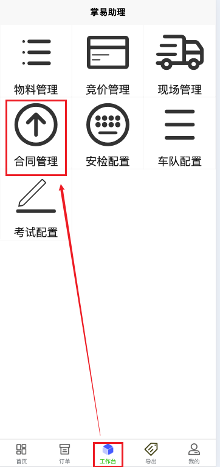
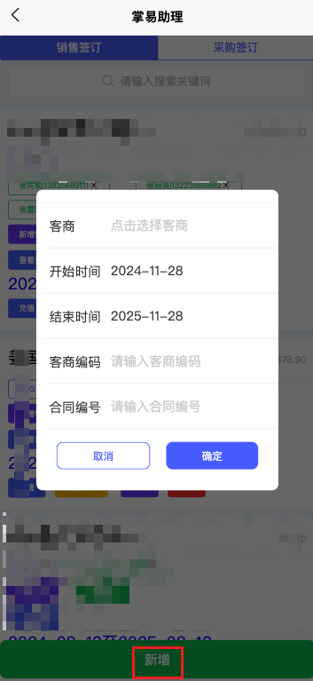
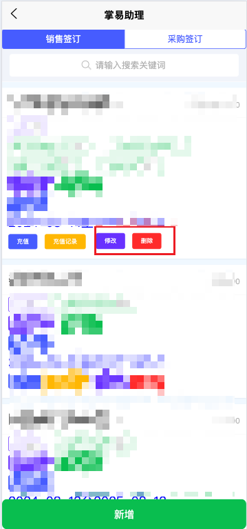
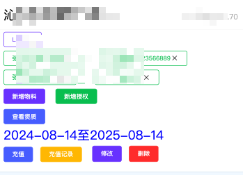

+++
title = '合同配置'
weight = 3
+++

## 配置前准备

+ 配置和供应商之间的合同时需要拥有采购管理权限
+ 配置和客户之间的合同时需要拥有销售管理权限
+ 需要拥有物料管理权限

## 配置思路

要想让客户或供应商在平台上下单，必须要先创建好合同并配置好合同与物料之间的对应关系。配置完毕后，对方的操作人员即可在系统中看到可以下单的物料以及对应的公司。

## 配置步骤

### 进入配置界面

在小程序工作台页面点击合同管理后进入合同配置的界面

### 合同增删

+ 在页面最上方可选择销售签订或采购签订，按需进入不同标签页分别操作
+ 点击页面最下方新增按键并输入相关配置项即可新增合同
+ 已增加的合同可以点击删除按键删除
+ 已增加合同可以点击修改按键，修改项同新增时的配置项

合同配置项含义

| 配置项   | 配置方式 | 含义                                                                                                           |
| ---------- | ---------- | ---------------------------------------------------------------------------------------------------------------- |
| 客商     | 选择     | 本合同的对方主体，若待选列表中无所需公司，需要让对方相关负责人先登录系统并正确绑定公司信息后重新进入本页面选择 |
| 开始时间 | 输入日期 | 标记本合同的开始日期，用于参考                                                                                 |
| 结束日期 | 输入日期 | 标记本合同的结束日期，合同快到期或到期后，对应的订单页面会有提示                                               |
| 客商编码 | 输入     | 仅作为参考，系统仅保存不做处理                                                                                 |
| 合同编号 | 输入     | 仅作为参考，系统仅保存不做处理                                                                                 |

### 合同细节配置

新增合同后，还需要一些关联物料、授权用户、充值等细节需要继续配置。

采购和销售合同支持的细节配置略有不同，在已添加的合同上可以看到支持的配置有哪些，具体含义如下

| 配置项   | 所属合同类型 | 配置方式   | 含义                                                                                                 |
| ---------- | -------------- | ------------ | ------------------------------------------------------------------------------------------------------ |
| 关联物料 | 采购和销售   | 选择       | 只有关联到本合同的物料，才能让对应的客户或供应商点击下单                                             |
| 授权用户 | 销售         | 输入手机号 | 对于销售合同，必须指定一个或多个授权手机号，只有授权手机号对应的客户侧操作人员下的单才能通过订单确认 |
| 充值     | 销售         | 输入       | 对于销售合同，需要有余额管理权限的用户操作充值                                                       |
