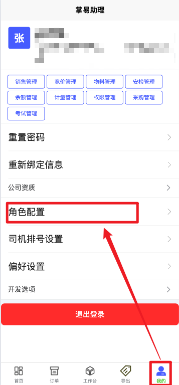
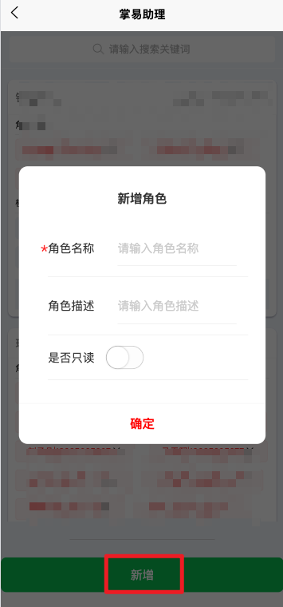
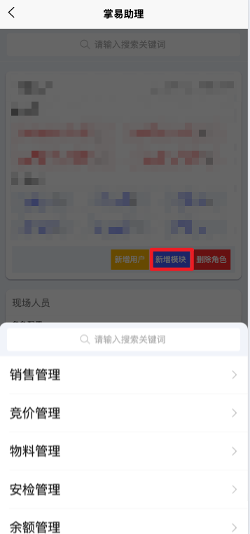
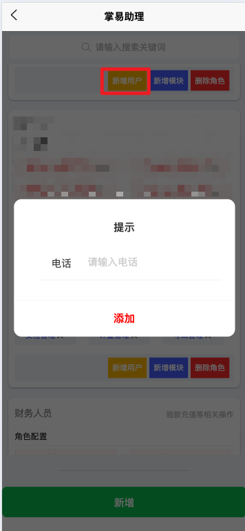

+++
title = '人员权限配置'
weight = 1
+++

## 配置前准备

+ 已经可以正常登录系统---》需要添加登录指南链接
+ 当前登录用户所属公司已经向平台官方注册为可接单公司
+ 当前登录用户已经由平台方指定为所属公司的初始管理员

## 配置思路

系统的权限配置模式是基于角色的访问控制（RBAC Role Based Access Control）,所以，权限配置的目标就是创建若干角色，然后再将模块和用户与每一个角色关联起来。配置完成后，系统会综合查询具体的用户是否与具体的某个模块通过任意角色完成匹配，若匹配则鉴权通过。

## 配置步骤

### 进入配置界面

小程序右下角*我的*界面中点击角色配置进入

> 只有拥有权限管理模块权限的用户才能进入角色配置页面

### 增删角色

点击页面最下方新增按钮，并输入角色名称、描述并设定是否只读。

若设定为只读，则该角色包含的模块只有读取权限无法写入或修改。

点击角色框右下角删除键可删除角色，删除角色后对应的模块和用户的关联也随之解开。

### 角色关联模块

在已增加的角色框下部点击新增模块并选择需要增加的模块。

已关联的模块可以点击右侧×取消关联

模块的含义如下：

| 模块名称 | 支持的读取操作                               | 支持的写入操作                                                                                 |
| ---------- | ---------------------------------------------- | ------------------------------------------------------------------------------------------------ |
| 销售管理 | 查看销售接单的订单详情、合同信息等           | 订单确认、验款、回退、授权客户、新增修改删除合同等                                             |
| 采购管理 | 查看采购接单的订单详情、合同信息等           | 订单确认、回退、新增修改删除合同等                                                             |
| 物料管理 | 查看当前配置的物料信息                       | 新增修改删除物料、修改物料规则例如是否需要排队、安检、考试等、调价、发布通知等                 |
| 竞价管理 | 查看已经存在的所有竞价信息                   | 创建修改删除竞价、开启结束竞价等                                                               |
| 安检管理 | 查看当前配置的安检规则和相关的安检信息       | 创建修改删除安检证件要求规则、创建修改删除现场检查表、执行已上传的安检信息审核、执行现场检查表 |
| 余额管理 | 获取客户充值记录                             | 执行充值                                                                                       |
| 计量管理 | 获取称重现场数据和设备状态、获取排队情况信息 | 叫号、手动计量、操作现场设备、确认装卸货                                                       |
| 考试管理 | 获取已经配置的试题和试卷                     | 创建修改删除试题和试卷                                                                         |
| 权限管理 | 获取当前配置的权限信息                       | 创建删除修改角色、角色关联用户、角色关联模块                                                   |

> 关联模块时，并不一定会看到上表中列出的所有模块，具体情况跟公司采购的模块数有关

### 角色关联用户

在已增加的角色下方点击新增用户并输入用户手机号即可，点击已关联的用户右侧×即可解除关联

> 被关联的手机号对应的用户需要先成功登录并正确绑定公司

