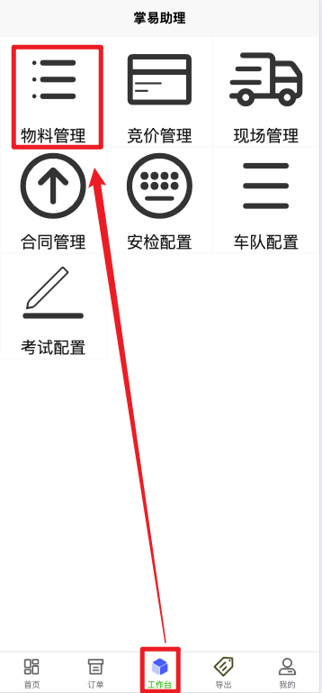
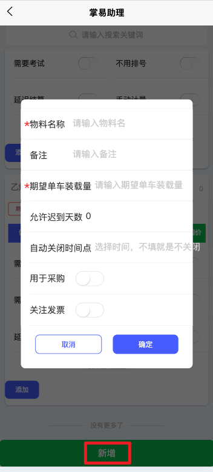
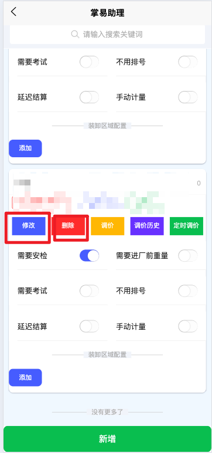

+++
title = '物料配置'
weight = 2
+++

## 配置前准备

+ 拥有物料管理权限

## 配置思路

在系统上进行的订单均与物料相关，不同的物料可以配置不同参数，应当先配置好需要在平台执行接单的物料信息。

## 配置步骤

### 进入配置界面

在小程序工作台页面点击物料管理后进入物料配置的界面

### 物料增删

+ 点击页面最下方新增按键并输入相关配置项即可新增物料
+ 已增加的物料可以点击删除按键删除
+ 已增加物料可以点击修改按键，修改项同新增时的配置项

物料的配置项含义如下

| 配置项         | 配置方式 | 含义                                                                                     |
| ---------------- | ---------- | ------------------------------------------------------------------------------------------ |
| 物料名称       | 输入     | N/A                                                                                      |
| 备注           | 输入     | 客户或供应商下单是可以看到这里编写的备注                                                 |
| 期望单车装载量 | 输入数字 | 物料作为销售用途时，验款的基准，即预扣款=该配置项*单价                                   |
| 允许迟到天数   | 输入数字 | 跨越订单的计划日期后多少天后自动关闭订单，默认0天则意味着当天订单会在夜晚凌晨自动关闭    |
| 自动关闭时间点 | 输入时间 | 上述自动关闭执行的时间点，若不配置就是永不执行自动关闭                                   |
| 用于采购       | 开关     | 表示该物料是否可以用于采购                                                               |
| 关注发票       | 开关     | 打开时，订单页面会显示并提供发票标记功能                                                 |
| 需要安检       | 开关     | 打开后，订单页面可见安检操作按钮，只有安检通过后才能排号                                 |
| 需要进厂前重量 | 开关     | 打开后，司机界面可见上传磅单按钮，只有上传来厂前的磅单才能排号（多用于采购场景）         |
| 需要考试       | 开关     | 打开后，司机界面可见考试按钮，考试通过后才能排号                                         |
| 不用排号       | 开关     | 打开后，司机界面无排号按钮。但与我司自研过磅系统配合使用时，不允许不排号                 |
| 延迟结算       | 开关     | 打开后，订单在发车后并不关闭和核减客户余额，需要客户在订单页面查看计量信息并确认后才结算 |
| 手动计量       | 开关     | 打开后，有计量管理权限的用户可以手动输入两次计量信息和最终装卸量，支持上传计量附件       |
