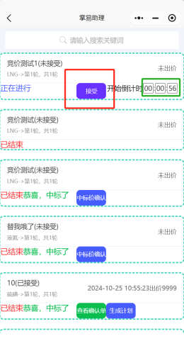
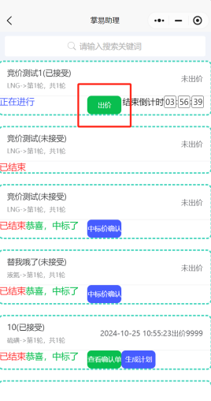
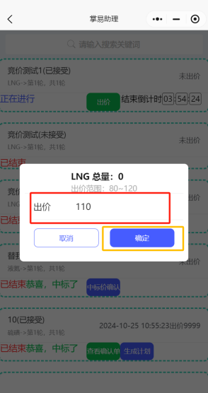
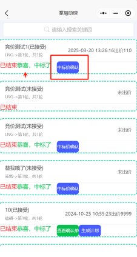
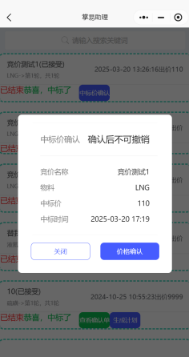
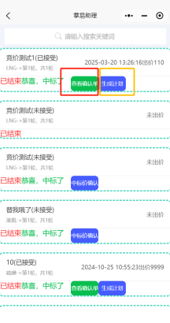

+++
title = '竞价参与'
weight = 11
+++

## 操作前准备

* 可以正常登录系统，接收竞价邀请消息

## 操作步骤

* 打开掌易助理小程序，点击工作台，点击竞价参与（当接单方发起竞价后，下单方可接受到掌易助理公众号推送竞价邀约通知）

* 在倒计时结束前，点击接受，方可进入接受竞价界面。

* 待倒计时结束后，刷新小程序进入出价界面，并点击出价。

* 输入出价价格，需控制在出家范围内，并点击确定，出价完毕。

* 竞价结束后，显示“已结束，恭喜，中标了”，点击中标价确认，弹出竞价详细信息，核对无误后，点击价格确认后，可查看确认单，并可直接生成计划，点击生成计划即跳转至提单界面，操作参考“订单创建”。

