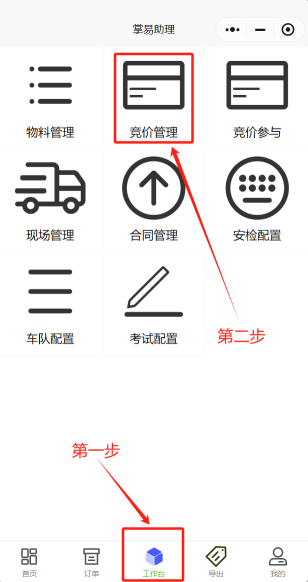
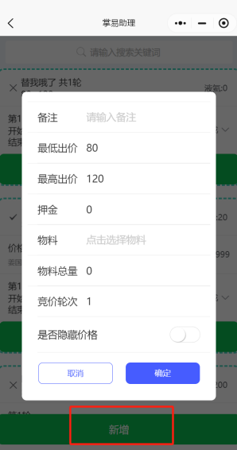

+++
title = '竞价管理'
weight = 10
+++

## 操作前准备

* 竞价操作前确保物料配置已经完毕，并可用。

## 操作步骤

* 进入掌易助理小程序，点击工作台，点击竞价管理。

* 点击新增，弹出竞价信息输入界面。

* 信息输入界面含义

| 名称         | 含义                             | 输入方式 |
| -------------- | ---------------------------------- | ---------- |
| 备注         | 可标注本次竞价关键词             | 手动输入 |
| 最低出价     | 限制本次竞价最低出价限度         | 手动输入 |
| 最高出价     | 限制本次竞价最高出价限度         | 手动输入 |
| 押金         | 本次竞价需要提前交付押金金额     | 手动输入 |
| 物料         | 本次竞价的物料名称               | 下拉选择 |
| 物料总量     | 本次竞价物料的总体数量           | 手动输入 |
| 竞价轮次     | 本次竞价进行的轮数               | 手动输入 |
| 是否隐藏价格 | 是否不对外公开本次竞价物料的价格 | 按钮选择 |
