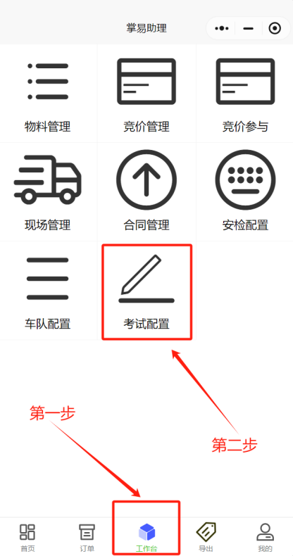
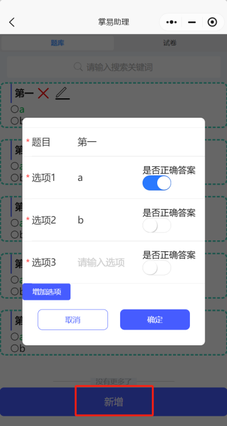
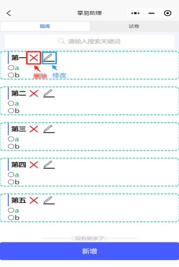
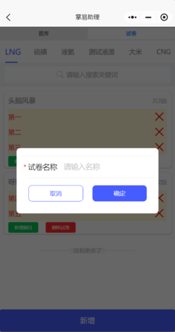
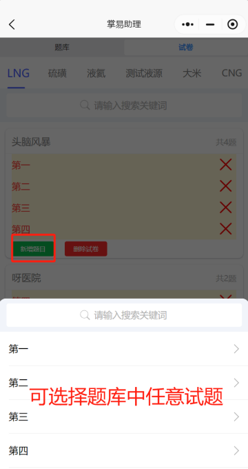

+++
title = '考试配置'
weight = 16
+++

## 操作前准备
* 在进行考试配置前，先应进行物料配置，试卷均为物料项下进行配置生成。
## 操作思路
* 考试配置是以题库为基础，在对应物料监管要求下进行考试试卷配置，即先可将所有题库内题目新增至题库，然后在对应物料下进行试卷配置。
## 被采购方人员操作步骤
### 题库配置
* 进入掌易助理小程序，点击工作台，点击考试配置。

* 点击新增，进行题库内考试试题增加，题目即为题干，选项1、2、3... ...可输入试题选项答案，正确答案即点击“是否正确答案”按钮。

* 新增后题库显示新增试题，新增试题也可进行修改或删除。

### 考试配置
* 点击试卷，在对应物料下点击新增

* 输入该套试卷名称，点击确定。

* 在新增试卷下，点击新增题目，可将题库中任意需要试题增加至该套试卷中，如不需要该套试卷，点击删除试卷即可，删除试卷对题库无任何影响。

* 以上即为考试配置全部内容。
