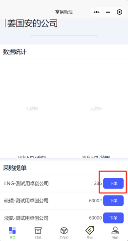
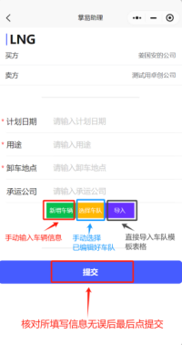
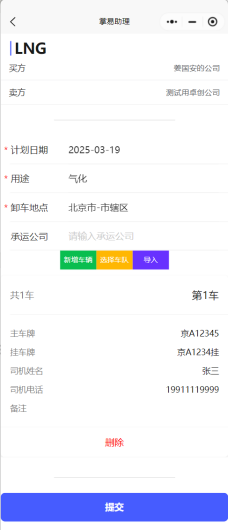
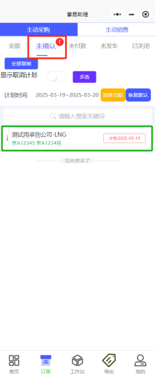
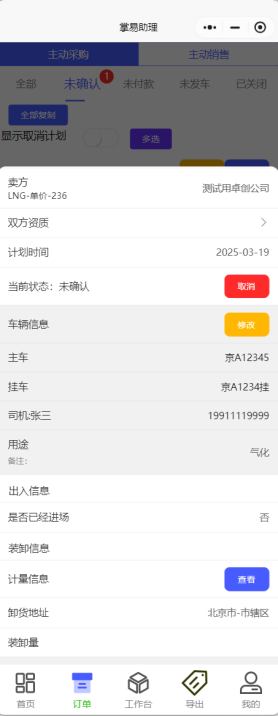

+++
title = '订单创建'
weight = 1
+++

## 操作主体

需要采购或销售下单的负责人

## 操作步骤

* 下单方注册并登录掌易助理小程序，选择需采购或销售的物料点击下单

* 输入订单计划日期、订单用途、卸车地点（以上均为下拉式选择），承运公司按实际要求填写（非必填项），所填写信息均无误后点击提交。

* 点击提交后，下单方进入未确认界面，同时可点击该条计划查看详细信息。

* 在计划详细信息内可对计划进行取消、对车辆信息进行修改等。

* 以上即为下单发起采购订单完毕。
