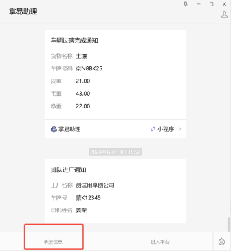
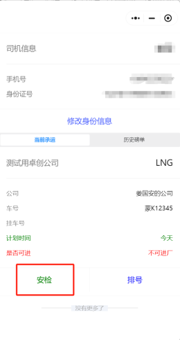
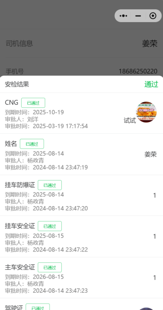
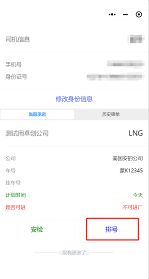
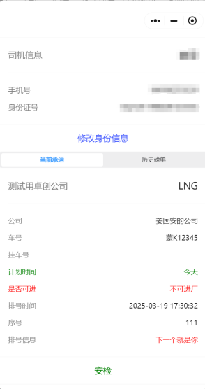
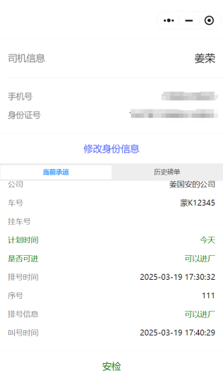

+++
title = '司机操作'
weight = 3
+++

## 操作主体

承运司机

## 操作步骤

* 当下单方及接单方均确认订单后，承运司机打开掌易助理微信公众号，注册并登录（注册时务必使用报计划使用手机号）点击承运信息。

* 进入承运信息界面后，点击安检，上传接单方要求上传证件，等待安检，

* 等待审核期间，司机需刷新查看是否通过，如有未通过则需重新上传。

* 待安检全部通过后，点击排号，并等待叫号。

* 接单方人员点击叫号，并点击进厂后，司机承运信息端显示如下

+ 以上均为司机操作步骤。
