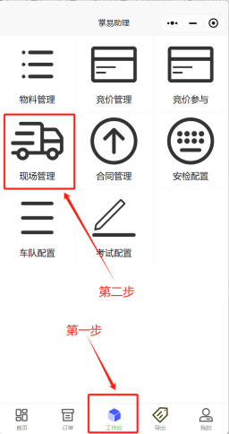
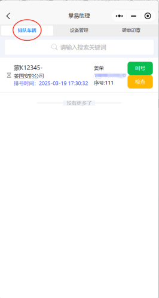
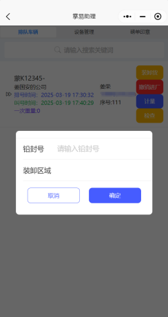

+++
title = '现场管理'
weight = 4
+++

## 操作主体

接单方现场管理人员

## 操作步骤

* 司机排号后，接单方人员进入掌易助理小程序，并点击工作台，点击现场管理。

* 点击排队车辆，显示目前已经符合要求并在排队车辆。

* 点击叫号，即可使承运车辆进厂装料，如有现场检查，可点击检查进行现场检查。

* 在点击叫号后，接单方人员可根据实际情况，对车辆进行过号、进厂、检查等操作，如无特殊情况，点击进厂。

* 在点击进厂后，车辆入厂装料，车辆完成装车出厂时，按照实际情况进行点击选择，如无特殊情况点击装卸货，弹出界面需输入铅封号，点击确认，该笔计划即已完成。

