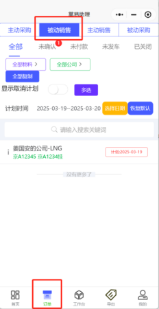
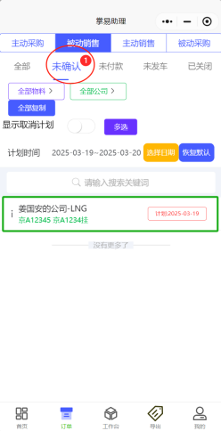
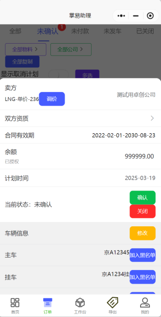
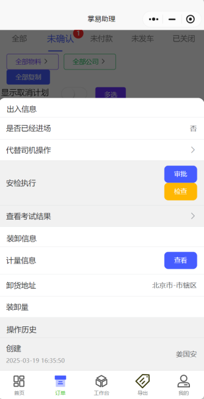
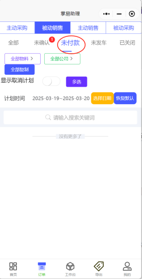
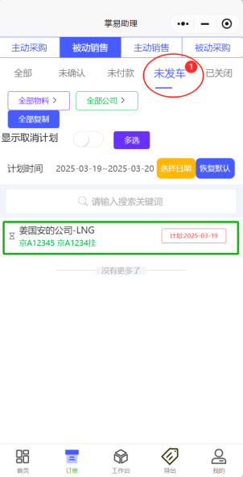
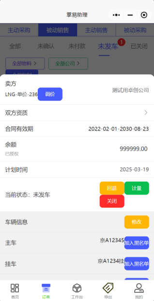
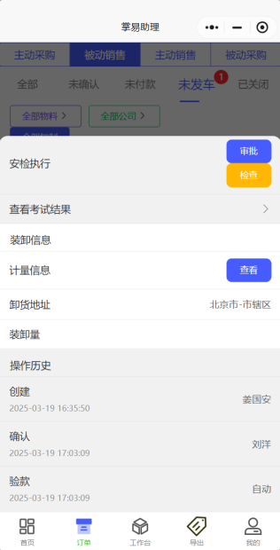

+++
title = '接单处理'
weight = 2
+++

## 操作主体

接单方操作人员

## 操作步骤

* 打开掌易助理小程序并登录，点击订单，并点击被动销售，即可显示当前订单信息。

* 可以看到，当前订单显示为未确认状态，点击未确认，并点击订单，查看订单内容。

* 接单方人员在订单详细信息界面可进行如下操作

1. 可对当前订单物料进行价格调整；
2. 可确认订单，或者关闭订单；
3. 可修改车辆信息；
4. 进行车辆安检证件审核审查；
5. 可查看计量信息。

* 在确认订单信息无误后，点击确认，如该笔订单对应公司余额不足，则进入未付款界面，需对方公司充值，接单方点击验款进入下一订单状态。

* 如该笔订单余额充足，则订单自动跳转未发车界面，点击未发车，并点击订单查看详细信息。

* 订单该状态下，接单方人员可进行如下操作

1. 可对该订单对应物料进行价格调整；
2. 可对订单进行回退，要求对方修改；
3. 可手动输入车辆皮重毛重等计量信息；
4. 可对车辆信息进行修改；
5. 可再次对案件信息进行审核审查。

* 以上为接单方人员订单处理步骤，后续等待车辆进厂，装料，出厂再进行操作即可。
