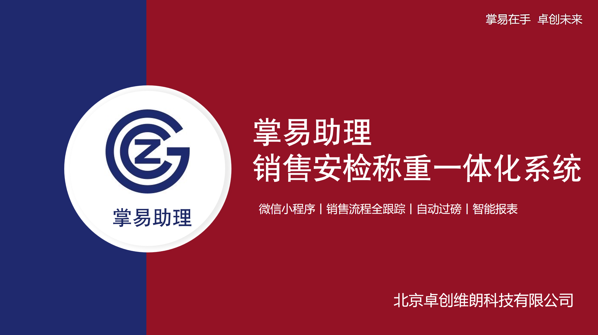

+++
title = '总览'
weight = 1
+++

# 系统简介

掌易助理平台是基于全国液化天然气行业核心业务逻辑打造的智能无人值守过磅及销售一体化平台，深度融合生产、运输、交易全链条场景，形成"业务闭环+数据智能"的双轮驱动体系。作为行业级数字化基座，其创新价值体现在三个维度：

## 智能协同中枢

系统以无人值守过磅为核心枢纽，将传统线下操作流程重构为标准化数字链路。用户仅需按照日常作业习惯完成资质上传、车辆信息录入（支持智能记忆与批量导入）、计划申报等操作，即可自动触发订单审核、安检核验、自动称重等11个智能节点。业务流与数据流的深度耦合，使液化天然气运输的"计划申报-车辆调度-过磅监管-结算归档"全流程实现无人化运转。

## 数据价值引擎

平台内置全生命周期追溯系统，通过订单状态的五阶段可视化追踪（创建-确认-收款-出货-归档），实现每车货物的时空轨迹数字化映射。所有操作痕迹自动沉淀为结构化数据池，支持一键导出计划表、资质文件及交易记录，为销售看板提供实时数据源。独创的"业务镜像"机制可将线下作业场景转化为多维分析模型，辅助企业构建销量预测、运力优化等决策图谱。

## 生态连接器

深度适配液化天然气行业特性，打通上下游企业的异构系统：买方可通过双路径（手动填报/Excel导入）发起运输需求，系统自动匹配卖方资源池；司机排号、证件安检等环节的标准化接口，使第三方物流系统可无缝接入。这种开放架构不仅降低生态协同成本，更通过竞价模块的动态议价能力，推动行业从传统供销模式向数字生态协作网络演进。

该系统通过"极简操作界面+智能决策内核"的二元设计，使一线人员无需改变作业习惯即可享受数字化红利，而管理者可通过数据驾驶舱透视产业链动态，真正实现"操作无感化，管理穿透化"的转型目标。
