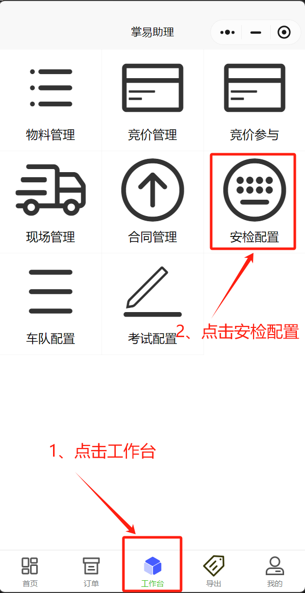
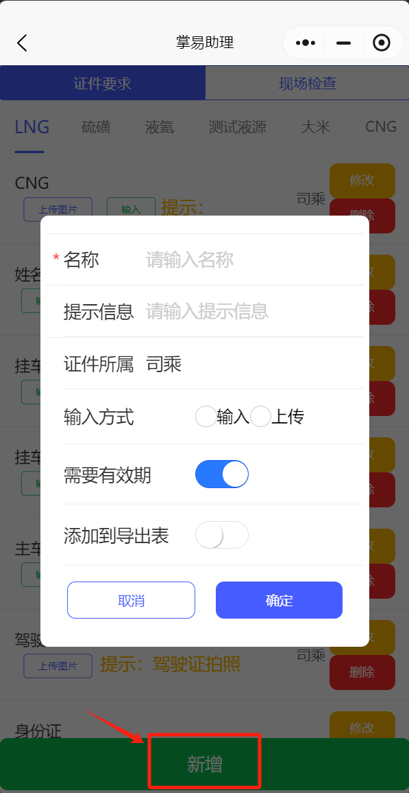
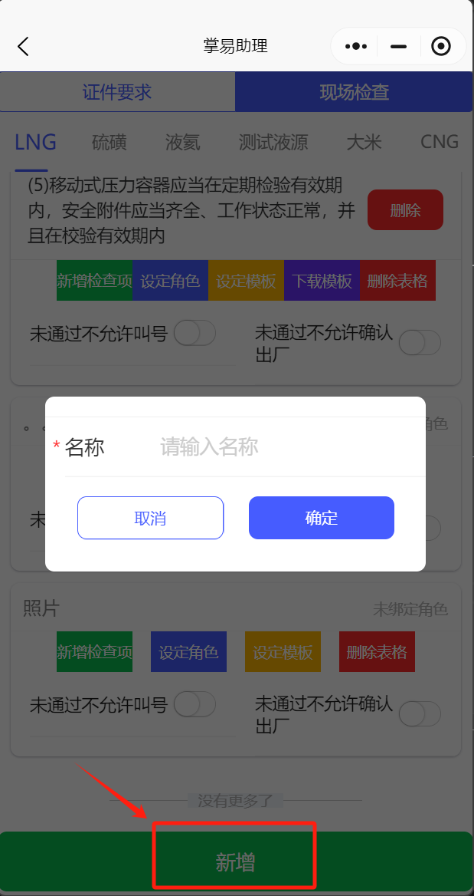

+++
title = '安检操作'
weight = 12
+++

## 操作前准备

+ 先进行安检配置权限，并在物料配置中已经配置物料。

## 操作思路

+ 各属地安检政策及各液厂安检方式不同，配置人员可根据要求自行选择配置内容，以此来符合监管需求。

## 被采购方工作人员操作步骤

### 进入配置界面

* 掌易助理小程序，点击下方工作台，点击安检配置，进入安检配置界面。

### 新增安检信息

#### 证件要求

* 点击新增，进入配置信息界面。

* 安检配置项含义

| 配置项       | 配置方式 | 含义                                           |
| -------------- | ---------- | ------------------------------------------------ |
| 名称         | 输入     | 一项安检材料的名称                             |
| 提示信息     | 输入     | 帮助司机理解该项材料的准确信息，来源或者说明   |
| 证件所属     | 下拉选择 | 该项安检材料归属方是司承、主车或挂车           |
| 输入方式     | 分项选择 | 该项安检材料的呈现形式，是要求输入还是上传图片 |
| 需要有效期   | 开关选择 | 该项安检材料是否需要添加有效期                 |
| 添加到导出表 | 开关选择 | 该项安检材料是否需要后续用于导出展示           |

* 均选择完毕后，新增一项安检材料，操作人员可按照政策要求增加任意安检材料。
* 司机入场前，进行安检信息输入或上传，操作人员逐项审核并通过，未符合要求可附言原因退回要求重新输入或上传，直至全部符合要求。

#### 现场检查

在装车过程中，可进行现场检查项筛查是否合格。

* 点击新增，进入配置信息界面

* 现场检查配置项含义
  点击输入现场检查内容，即可生成一项现场需检查内容，在本项内容中可新增二级检查内容，设定对应角色，并可设定为模板进行表格导出，也可删除表格。

## 司机操作步骤

1. 进入掌易助理公众号，点击承运信息，进入承运信息界面。
2. 在承运信息中点击安检，根据被采购方要求，按序输入或上传证件信息或图片。
3. 刷新等待审核通过即完成安检，若不通过被退回，请根据对方附言要求输入或上传正确信息。
