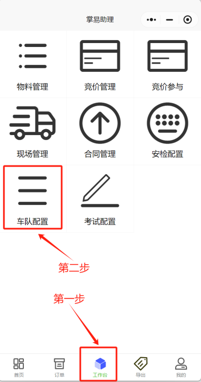
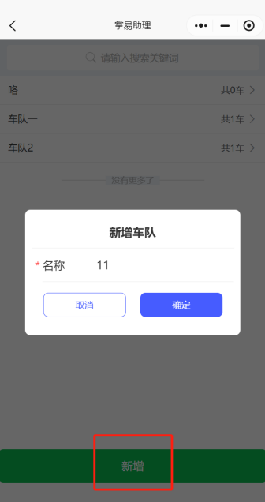

+++
title = '车队配置'
weight = 15
+++

## 操作前准备

* 车队配置需提前准备好订单下对应车辆信息，提前进行车辆配置。

## 操作思路

* 如订单数量较为庞大，则在提单过程中需要输入大量车辆信息，故使用车队配置可进行批量导入或提前输入，以此提升提单过程效率。

## 操作步骤

* 进入掌易助理小程序，点击工作台，点击车队配置。

  
* 点击新增，并输入车队名称。

* 点击已经新增车队

* 车辆信息输入有两种方式，点击新增车辆即为手动输入车辆信息，点击导入车辆即按照模板进行批量导入，模板可下载修改。

* 以上即为车队配置操作步骤。
